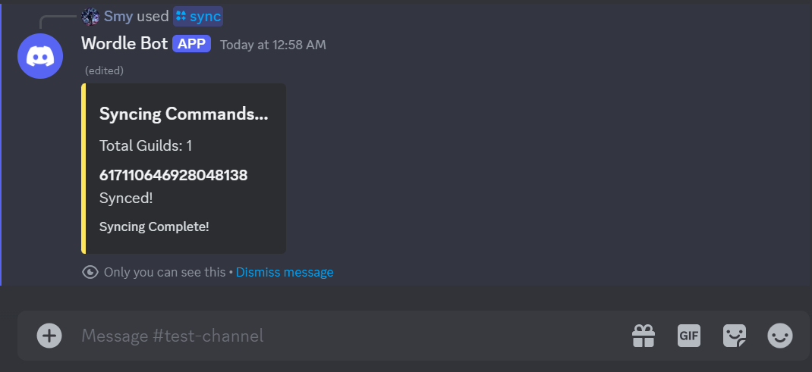
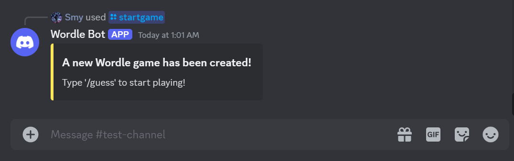
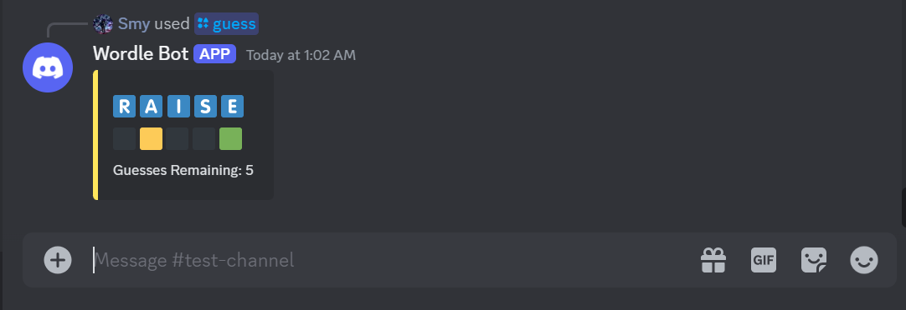
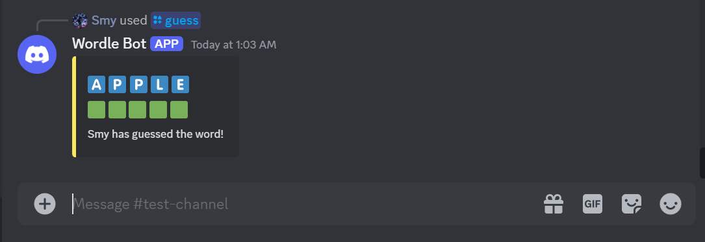

# Project Overview

This project is a bot application for use with the platform Discord.

This application was created using the Discord.py API.

This Discord bot can create Wordle games which users can play in their own Discord servers.

Available words are stored in the words.json file, which can be edited if wanted.

Additionally, the program creates a wordlebot.log during runtime to help debug issues.

---

## Commands ✏️

**/sync:** 
    
    Permission: Administrator

    Description:
    Syncs the script commands to Discord.

**/startgame:** 
    
    Permission: Member

    Description: 
    Creates a new Wordle game with 6 attempts. Words are taken from the words.json file. Cannot be called if there is currently an active game.

**/guess:** 
    
    Permission: Member

    Description:
    Allows a user to submit a guess to the active Wordle game. Guesses must be only 5 letters long and must contain only alphabetic characters.

---